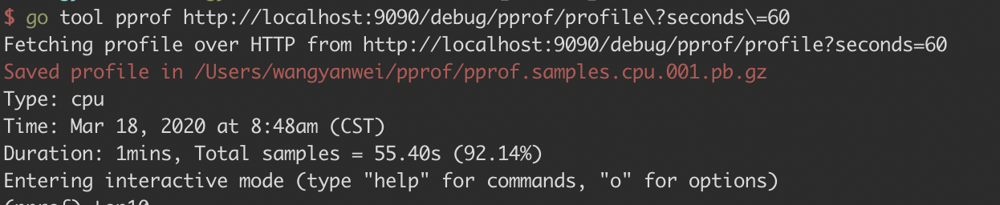
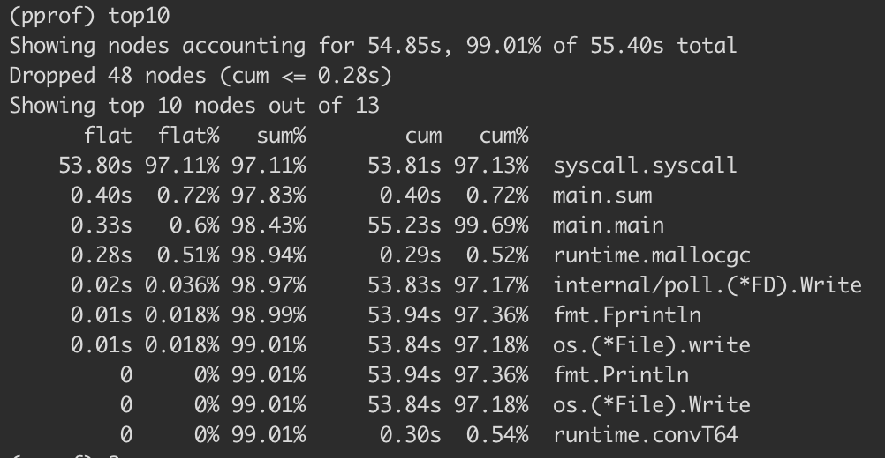
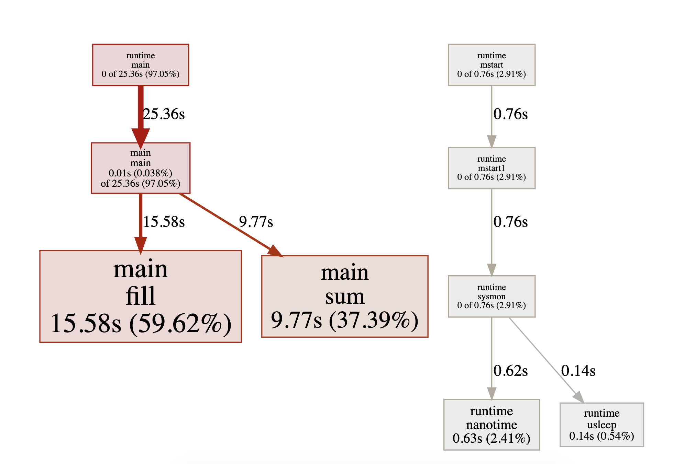
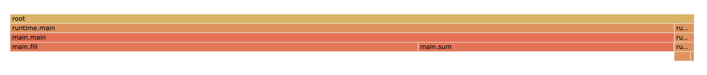
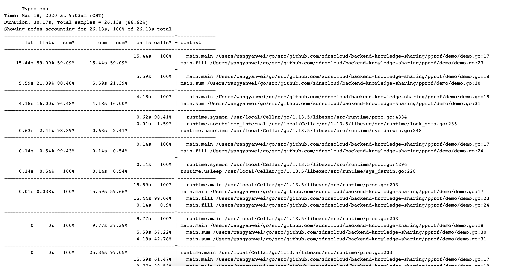
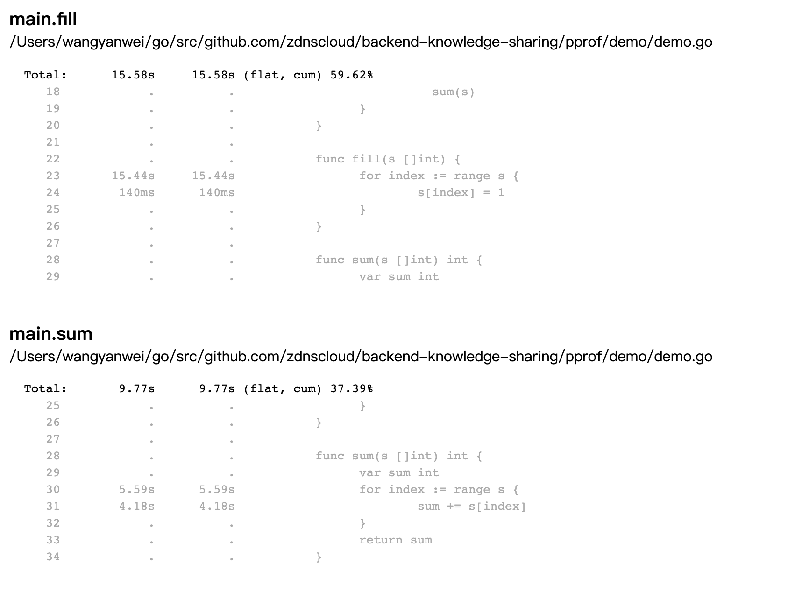

# Golang PProf
## 前言
我们日常在使用 Golang 开发服务后端时，有时候难免产生一些性能问题，如内存泄漏、Goroutine 死锁等，这时候我们就需要对程序做性能分析，找出性能瓶颈点，这个工具就是官方的`pprof`库。
## PProf 关注的模块
* CPU profile：报告程序的 CPU 使用情况，按照一定频率去采集应用程序在 CPU 和寄存器上面的数据
* Memory Profile（Heap Profile）：报告程序的内存使用情况
* Block Profiling：报告 goroutines 不在运行状态的情况，可以用来分析和查找死锁等性能瓶颈
* Goroutine Profiling：报告 goroutines 的使用情况，有哪些 goroutine，它们的调用关系是怎样的
## 用法
PProf 可以从以下两个包中引入：
```go
import "net/http/pprof"
import "runtime/pprof"
```
其中 net/http/pprof 使用 runtime/pprof 包来进行封装，并在 http 端口上暴露出来。runtime/pprof 可以用来产生 dump 文件，再使用 Go Tool PProf 来分析这运行日志。
使用 net/http/pprof 可以做到直接看到当前 web 服务的状态，包括 CPU 占用情况和内存使用情况等。
如果服务是一直运行的，如 web 应用，第一种更方便一些，import pprof包之后起一个gotoutine做pprof的监听即可：
```go
package main

import (
    "fmt"
    _ "net/http/pprof"
)

func main() {
    go func() {
        fmt.Println("start pprof")
        http.ListenAndServe("0.0.0.0:9090", nil)
    }()
    ...
}
```
`runtime/pprof`的使用方式为在程序中调用该包的api，将profile信息写入文件，再使用`go tool pprof`打开文件的方式使用，适合在非daemon的程序中使用，下面主要讲解`net/http/pprof`的使用
> pprof可视化需要`graphviz`，mac安装方式：`brew install graphviz`
## 示例
* code
```go
package main

import (
	"fmt"
	"net/http"
	_ "net/http/pprof"
)

func main() {
	go func() {
		fmt.Println("start pprof")
		http.ListenAndServe("0.0.0.0:9090", nil)
	}()

	s := make([]int, 10000)
	for {
		fill(s)
		fmt.Println(sum(s))
	}
}

func fill(s []int) {
	for index := range s {
		s[index] = 1
	}
}

func sum(s []int) int {
	var sum int
	for index := range s {
		sum += s[index]
	}
	return sum
}
```
### 交互式终端方式
命令：`go tool pprof http://localhost:9090/debug/pprof/profile?seconds=60`

执行该命令后，需等待 60 秒（可调整 seconds 的值），pprof 会进行 CPU Profiling。结束后将默认进入 pprof 的交互式命令模式，可以对分析的结果进行查看或导出。具体可执行 pprof help 查看命令说明

* flat：给定函数上运行耗时
* flat%：同上的 CPU 运行耗时总比例
* sum%：给定函数累积使用 CPU 总比例
* cum：当前函数加上它之上的调用运行总耗时
* cum%：同上的 CPU 运行耗时总比例
最后一列为函数名称，在大多数的情况下，我们可以通过这五列得出一个应用程序的运行情况，加以优化
通过指定不同的url path来分别查看内存、block等信息
`go tool pprof http://localhost:6060/debug/pprof/block`
`go tool pprof http://localhost:6060/debug/pprof/heap`
### 可视化web方式
命令：`go tool pprof -http=:8080  http://localhost:9090/debug/pprof/profile`
> 注意这个地方监听的8080是pprof可视化工具的web端口，和程序里的9090端口作用不同，程序里的端口是用于输出profile数据，这里的8080是为了将可视化信息输出到web
* Graph

框越大，线越粗代表它占用的时间越大
* Flame

* Peek

* Source
